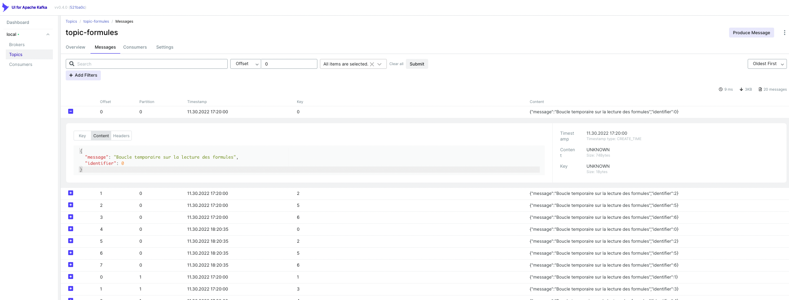

## CAS PRATIQUES

## Prérequis techniques

Les éléments suivants doivent être installés sur le poste de travail
- [OpenJDK 17](https://jdk.java.net/java-se-ri/17)

## Lancement des builds applicatifs via Gradle

Lancer la commande suivante dans les dossiers `salle-de-sport/` et `formule-service-kafka/`
- `./gradlew build` si lancée depuis un terminal Linux ou Linux-like comme Git Bash
- `gradlew build` si lancée depuis une terminer PowerShell

## Lancement des tests

Lancer la commande suivante dans les dossiers `salle-de-sport/` et `formule-service-kafka/`
- `gradle test`

---

## Lancement des applications et services

### KAFKA

* Exécuter le script pour démarrer Kafka, son dashboard associé, et la BDD postgresql DB-Formules
```sh
./start-kafka.sh
open http://localhost:8090
```

### Le Service Formule, utilisant le broker de messages Kafka

* Exécuter la commande suivante dans le dossier `formule-service-kafka/`
```sh
./gradlew bootRun
open http://localhost:8080/api/swagger-ui/index.html
```

## Première vérification

* Via le swagger, faire un GET /formules
* Vérifier dans le dashboard kafka que des messages ont été envoyés



