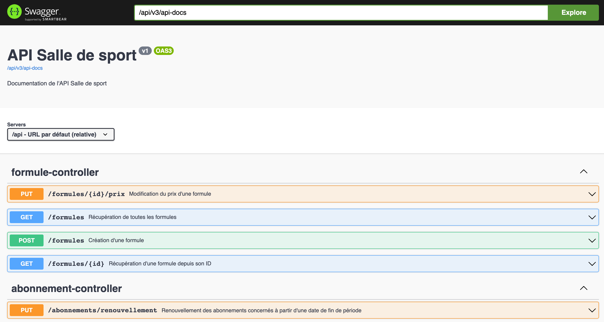

# API Salle de sport - version 1

## Services

- Créer des nouvelles formules, au mois ou à l'année, avec les règles suivantes :
    - un prix de base est fixé,
    - auquel on applique 30% de réduction si le client souscrit à un abonnement annuel

  
- Appliquer aux étudiants, 20% de réduction sur le prix de son abonnement

- Voir le chiffre d'affaire en fonction du nombre d'abonnements en cours pour une fin de période donnée

- Envoyer au client, un email avec le détail de son abonnement à la souscription

- Changer changer le prix d'une formule

- Renouveller automatiquement un abonnement

---

## Prérequis techniques

Les éléments suivants doivent être installés sur le poste de travail :
- [OpenJDK 17](https://jdk.java.net/java-se-ri/17)

## Lancement du build applicatif via Gradle

Lancer la commande suivante dans le dossier `api-monolithe/`
- `./gradlew build` si lancée depuis un terminal Linux ou Linux-like comme Git Bash
- `gradlew build` si lancée depuis une terminer PowerShell

## Lancement des tests

Lancer la commande suivante dans le dossier `api-monolithe/`
- `gradle test`

## Lancement de l'application

Lancer la commande suivante dans le dossier `api-monolithe/`
- `gradle bootRun`

## Accès à l'application

[http://localhost:8080/api/swagger-ui/index.html](http://localhost:8080/api/swagger-ui/index.html)

