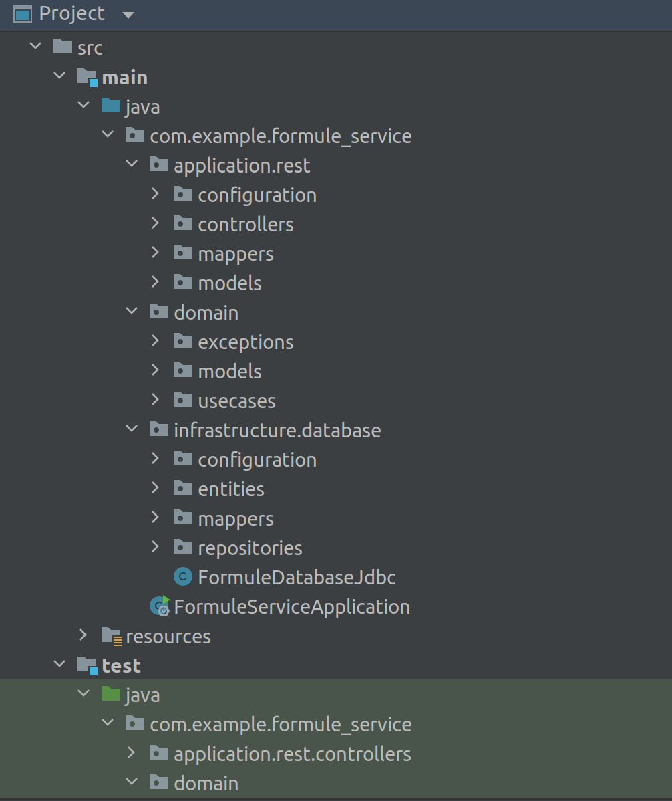
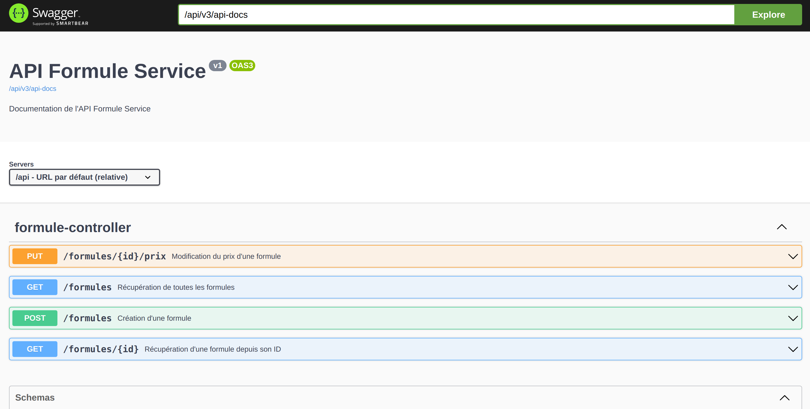

# API Formule Service

## Services

- Créer des nouvelles formules, au mois ou à l'année, avec les règles suivantes
    - un prix de base est fixé,
    - auquel on applique 30% de réduction si le client souscrit à un abonnement annuel

- Changer le prix d'une formule

---

## Structure de l'application

## Prérequis techniques

Les éléments suivants doivent être installés sur le poste de travail
- [OpenJDK 17](https://jdk.java.net/java-se-ri/17)

## Lancement du build applicatif via Gradle

Lancer la commande suivante dans le dossier `formule-service/`
- `./gradlew build` si lancée depuis un terminal Linux ou Linux-like comme Git Bash
- `gradlew build` si lancée depuis une terminer PowerShell

## Lancement des tests

Lancer la commande suivante dans le dossier `formule-service/`
- `gradle test`

## Lancement de l'application

Lancer la commande suivante dans le dossier `formule-service/`
- `gradle bootRun`

## Accès à l'application

[http://localhost:8081/api/swagger-ui/index.html](http://localhost:8081/api/swagger-ui/index.html)

